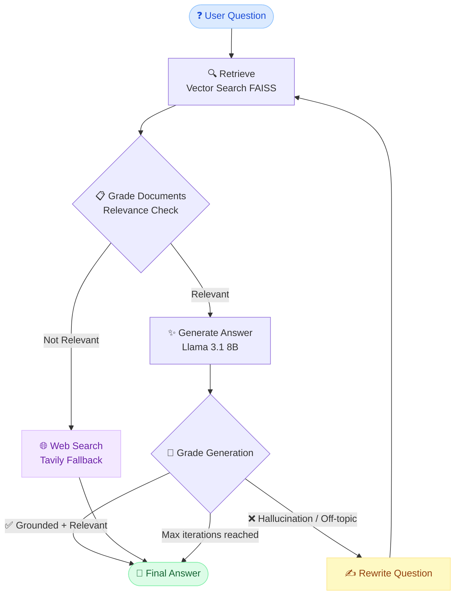

# 🧠 AI Document Analysis — Adaptive RAG

An intelligent document Q&A system powered by **Adaptive RAG** (Retrieval-Augmented Generation) with self-reflection, hallucination detection, and web search fallback.

🔗 **Live Demo**: [yusuf-documents.streamlit.app](https://yusuf-documents.streamlit.app)

---

## 🏗️ RAG Architecture



---

## ✨ Features

| Feature | Description |
|---|---|
| 📄 **PDF Upload** | Upload any PDF and ask questions about it |
| 🔍 **Vector Retrieval** | FAISS vector search with `all-MiniLM-L6-v2` embeddings |
| 🧠 **LLM Generation** | Grounded answers using `llama-3.1-8b-instant` via Groq |
| ✅ **Hallucination Check** | Auto-validates every answer against source documents |
| 🌐 **Web Fallback** | Falls back to Tavily web search if PDF lacks info |
| ✍️ **Self-Reflection** | Rewrites and retries questions up to 3 iterations |
| ⚡ **Parallel Grading** | Hallucination + relevance graders run in parallel |

---

## � Local Setup

```bash
git clone https://github.com/yusuf-analytics/Rag-Document.git
cd Rag-Document
pip install -r requirements.txt
```

Create a `.env` file:
```env
GROQ_API_KEY=your_groq_api_key
GOOGLE_API_KEY=your_google_api_key
TAVILY_API_KEY=your_tavily_api_key
```

Run the app:
```bash
streamlit run streamlit_app.py
```

---

## ☁️ Streamlit Cloud Deployment

In **Settings → Secrets**, add:
```toml
GROQ_API_KEY = "your_key"
GOOGLE_API_KEY = "your_key"
TAVILY_API_KEY = "your_key"
LANGCHAIN_API_KEY = ""
```

---

## �️ Tech Stack

| Layer | Technology |
|---|---|
| LLM | Groq — `llama-3.1-8b-instant` |
| Embeddings | `all-MiniLM-L6-v2` (Sentence Transformers) |
| Vector Store | FAISS |
| Orchestration | LangGraph |
| Web Search | Tavily |
| Framework | LangChain + Streamlit |
